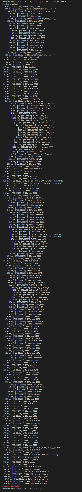

# Call_Trace
一个IDA插件，可以自动生成frida脚本，该脚本可以帮助您观察函数调用关系。

本脚本参考于**[oacia/stalker_trace_so](https://github.com/oacia/stalker_trace_so)**的实现方式，在原基础上，添加了函数调用关系。

**间接调用**：如果函数通过指针调用（非bl指令），可能无法正确追踪。

**返回检测**：仅依赖ret指令，可能误判非函数返回的ret，但调用栈检查减少了这种风险。

**返回值**：无法获取返回值，退出日志中省略了返回值字段。

效果如下图所示。

用法和oacia大佬的一样。
